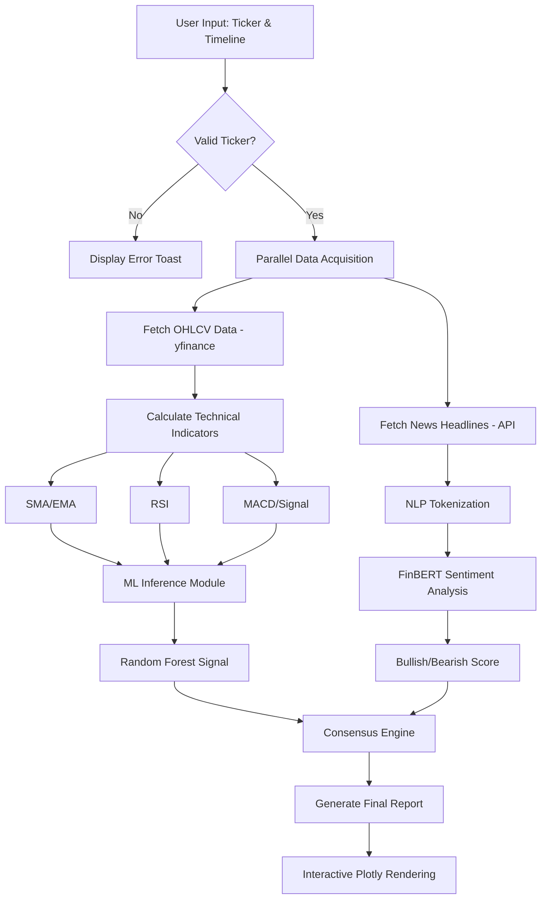
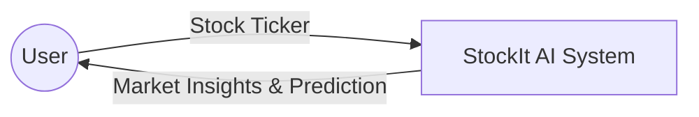
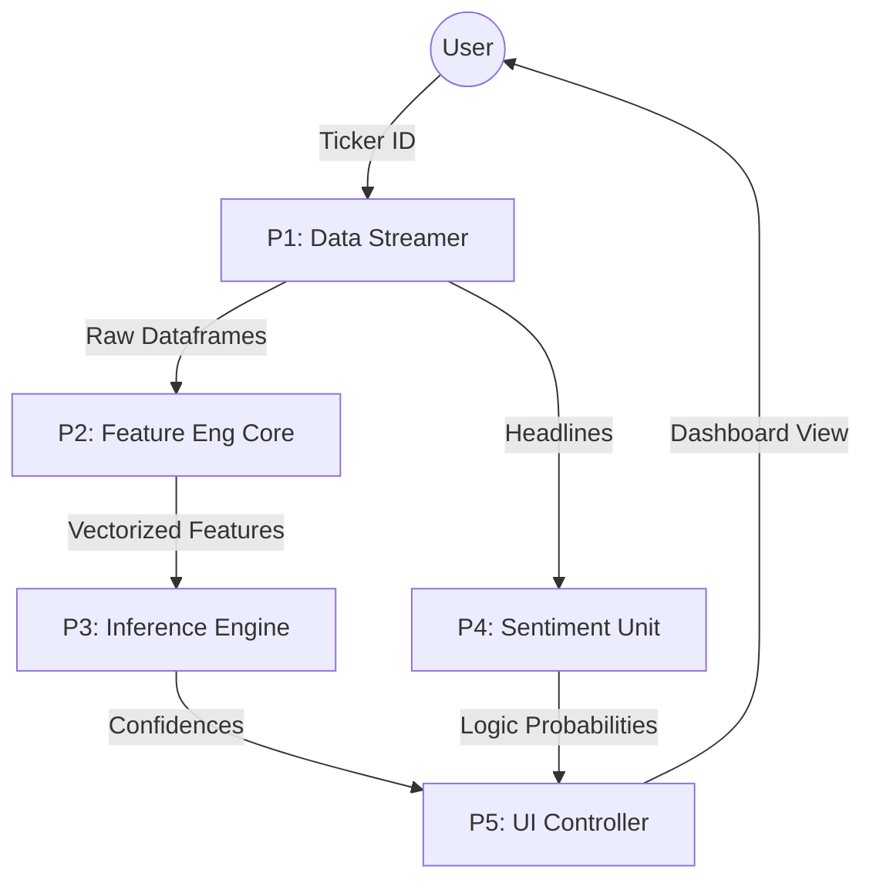
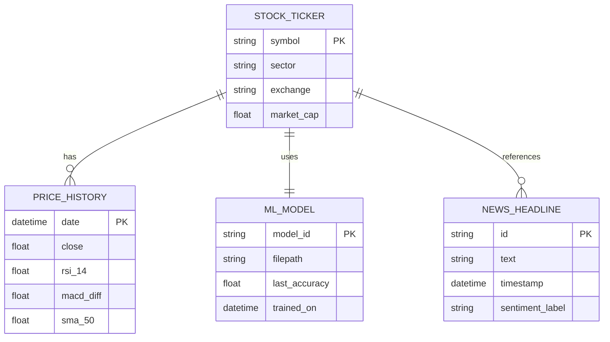

# PROJECT REPORT
## StockIt AI: Institutional Grade Stock Analytics and Prediction Platform

**Location:** [Your Institution Name]  
**Academic Year:** 2024-2025  
**Course:** [Your Degree/Course Name]  

---

### 1. Cover Page
**Project Title:** StockIt AI Analytics  
**Subtitle:** A Hybrid Ensemble Learning and Transformer-Based Sentiment Analysis Platform for Stock Market Forecasting  
**Author:** [Your Name]  
**Registration Number:** [Your Reg No]  
**Supervisor:** [Supervisor Name]  

---

### 2. Certificate
**TO WHOMSOEVER IT MAY CONCERN**

This is to certify that the project entitled **"StockIt AI: Institutional Grade Stock Analytics and Prediction Platform"** is a bona fide record of work carried out by **[Your Name]** under my supervision and guidance. This work has not formed the basis for the award of any other degree or diploma previously.

Date: 13th April 2026  
Place: [Location]  

(Signature of Supervisor)  
(Signature of Head of Department)  

---

### 3. Abstract
The "StockIt AI" project is a comprehensive software solution designed to bridge the gap between complex quantitative financial modeling and intuitive retail investing. Traditional stock analysis often requires significant manual effort to correlate technical indicators with market sentiment. This project automates this pipeline by integrating real-time market data from the Yahoo Finance API, calculating seven core technical indicators (SMA, EMA, RSI, MACD, etc.), and employing a robust Random Forest machine learning model to predict price trends.

Furthermore, the system incorporates "FinBERT," a domain-specific BERT model, to perform high-fidelity sentiment analysis on financial news headlines. This dual-layered approach—combining quantitative technical analysis with qualitative news sentiment—provides a 360-degree view of market dynamics. Developed using Python and the Streamlit framework, the application features a premium dark-themed user interface, interactive Plotly visualizations, and a modular architecture ensuring scalability and maintainability.

---

### 4. Table of Contents
| No. | Section Title | Page No. |
|---|---|---|
| 1 | Introduction | 5-7 |
| 1.1 | Objective of the Project | 5 |
| 1.2 | Brief Description | 6 |
| 1.3 | Technology Used (H/W & S/W) | 7 |
| 2 | Design Description | 8-10 |
| 2.1 | Flow Chart | 8 |
| 2.2 | Data Flow Diagrams (DFDs) | 9 |
| 2.3 | Entity Relationship Diagram (E-R) | 10 |
| 3 | Project Description | 11-13 |
| 3.1 | Database Design | 11 |
| 3.2 | Table Description | 12 |
| 3.3 | File System Architecture | 13 |
| 4 | Input/Output Form Design | 14-15 |
| 5 | Testing & Tools | 16-17 |
| 6 | Implementation & Maintenance | 18-19 |
| 7 | Conclusion and Future Work | 20-21 |
| 8 | Outcome | 22 |
| 9 | Bibliography | 23 |

---

### 1. Introduction

#### 1.1 Objective of the Project
The primary objective of **StockIt AI** is to provide a unified, institutional-grade analytics environment for retail investors. In the modern financial landscape, the sheer volume of data—from technical ticker movements to global macroeconomic news—is overwhelming for individual traders. This project aims to solve this by:
- **Automating the Analytical Pipeline:** Traditional stock analysis involves shifting between multiple platforms (e.g., Bloomberg for news, TradingView for charts, and Excel for modeling). StockIt AI centralizes these into a single, high-performance dashboard.
- **Improving Prediction Accuracy:** By utilizing ensemble learning (Random Forest), the project moves beyond simple linear regressions. It captures non-linear relationships between indicators like RSI and MACD, which are often missed by human analysts.
- **Decoding Market Sentiment:** Stock prices are driven as much by psychology as by numbers. The objective here is to quantify "market mood" using state-of-the-art transformer models (FinBERT), allowing users to see if the prevailing news cycle is Bullish, Bearish, or Neutral.
- **Educational Empowerment:** Through interactive descriptions and tooltips, the project serves as an educational tool, explaining *why* certain signals are generated and how technical indicators like the Relative Strength Index (RSI) function.
- **Reliable Backend Architecture:** Building a system that can handle real-time API rate limits, data cleaning, and local model persistence ensuring 24/7 availability for market analysis.

#### 1.2 Brief Description of the Project
StockIt AI is a full-stack data science application tailored for the financial sector. At its core, it is a **Hybrid Intelligent System** that merges Quantitative Technical Analysis (QTA) with Natural Language Processing (NLP).

The system architecture is divided into three distinct logic layers:
1.  **The Ingestion Layer:** This layer is responsible for high-speed connectivity with the Yahoo Finance (yfinance) ecosystem. It fetches "Historical OHLCV" (Open, High, Low, Close, Volume) data. This raw data is then cleaned, ensuring no gaps exist due to market holidays or temporary ticker suspensions.
2.  **The Processing Layer (The AI Core):** 
    - **Technical Indicators:** The system calculates over 7 distinct mathematical signals. This includes the Simple Moving Average (SMA) for trend identification, the Exponential Moving Average (EMA) for faster trend reaction, the RSI for identifying overbought/oversold conditions, and the MACD for momentum analysis.
    - **Random Forest Classifier:** This is the "brain" of the prediction module. Unlike simple neural networks, Random Forests are superior for financial tabular data as they are less prone to overfitting and can handle the inherent noise of the stock market. It is trained to look for specific "profitable windows"—specifically identifying setups that result in a 5% gain in 10 trading days.
    - **FinBERT Sentiment Engine:** Leveraging the Hugging Face `transformers` library, the system processes live news feeds. FinBERT is specifically trained on the *Financial PhraseBank*, meaning it understands that the word "breakout" in a stock context is a positive signal, whereas a general-purpose model might see it as neutral.
3.  **The Presentation Layer (UI/UX):** Built using Streamlit, the UI follows "Premium Dark Mode" aesthetics. It uses Glassmorphism (semi-transparent blurred backgrounds) and JetBrains Mono typography for a high-tech, professional feel. Interactive charts built with Plotly allow users to zoom into specific candles, hover for precise prices, and compare multiple tickers (like TCS vs. INFY) on a single axis.

#### 1.3 Technology Used
The choice of technology was driven by the need for high-performance computation and rapid UI rendering.

##### 1.3.1 Hardware Requirements Detail
The following table summarizes the hardware specifications required to run the StockIt AI system optimally.

| component | Minimum Specification | Recommended Specification | Rationale |
|---|---|---|---|
| **Processor (CPU)** | Intel Core i5 (8th Gen) | Intel Core i7 or AMD Ryzen 7 | Handling vectorized matrix ops + model inference. |
| **Memory (RAM)** | 8 GB LPDDR4 | 16 GB or 32 GB | Keeping the local FinBERT weights in cache memory. |
| **GPU / AI Accel** | Integrated Graphics | NVIDIA RTX 30-series (CUDA) | Accelerating Transformer tokenization. |
| **Disk Storage** | 1 GB SSD | 5 GB SSD | Fast I/O for model pickles (.pkl files). |
| **Networking** | 5 Mbps Stable | 25+ Mbps Fiber | Low-latency API calls to Yahoo Finance. |

##### 1.3.2 Software Stack Detail
| Category | Technology | Purpose |
|---|---|---|
| **Base Language** | Python 3.10 | Core logic and scripting. |
| **Frontend Framework** | Streamlit | Rapid UI rendering and state management. |
| **Numerical Engine** | NumPy / Pandas | High-speed data manipulation. |
| **ML Framework** | Scikit-Learn | Training Random Forest ensembles. |
| **DL / NLP Library** | PyTorch / Transformers | Running the FinBERT model. |
| **Visualization** | Plotly / Interactive Subplots | rendering OHLCV charts. |
| **Persistence** | Joblib | Binary serialization of trained models. |

---

### 2. Design Description

#### 2.1 Flow Chart
The operational logic of StockIt AI is designed to be cyclical and user-centric. The flow is as follows:
1.  **Input Phase:** The user provides a Ticker and chooses a timeframe (e.g., "1y").
2.  **Validation Phase:** The system checks if the ticker is valid in the Yahoo Finance database. If invalid, an error toast is triggered.
3.  **Extraction Phase:** `fetch_stock_data` parallelizes the retrieval of price history and news headlines.
4.  **Transformation Phase:** The `indicators.py` module runs a series of vectorized computations across the dataframe, adding columns for SMA, RSI, and MACD.
#### 2.1 System Logic Flow Chart
The following diagram illustrates the high-level logic flow of the StockIt AI application, from the initial user request to the final consensus generation.

#### 2.2 Data Flow Diagrams (DFDs)
The DFD provides a view of how data is transformed as it moves through the system.

**Level 0 DFD (Context Diagram):**

**Level 1 DFD (Process Decomposition):**

#### 2.3 Entity-Relationship Diagram (ER Diagram)
The ER diagram visualizes the data relationships within the StockIt AI "Virtual Database" schema.

---

### 3. Project Description

#### 3.1 Database Design (The "Virtual Database")
The "Database" of StockIt AI is a hybrid of **On-Disk Persistence** and **Cloud Streaming**. 
Since stock data changes every second, storing millions of historical records in a local SQL database would be inefficient and quickly outdated. Instead, we use:
- **Stream-on-Demand:** Live data is streamed directly into Pandas DataFrames. This "Virtual Database" exists in the application's RAM during the session, allowing for millisecond-speed calculations.
- **The Model Registry:** A local directory (`/models/`) acts as the "Persistent Store" for intelligence. Each `.pkl` file is a serialized object containing the weights, tree structures, and feature normalization parameters of the Random Forest.
- **Standardized I/O:** All data entering the system is standardized to a UTC-timezone, ensuring that comparing US stocks (AAPL) with Indian stocks (TCS) doesn't result in time-alignment errors.

#### 3.2 Technical Indicator Schema & Significance
The following table provides a deep-dive into the technical indicators utilized by the Random Forest model and their significance in forecasting price trends.

| Indicator | Calculation | Market Meaning | Model Weight (Approx) |
|---|---|---|---|
| **SMA 50** | 50-day Simple Moving Average | Mid-term trend support/resistance. | 15% |
| **SMA 200** | 200-day Simple Moving Average | Long-term "Institutional" trend line. | 10% |
| **RSI (14)** | $100 - (100 / (1 + RS))$ | Measures velocity and magnitude of directional price moves. | 25% |
| **MACD** | $EMA(12) - EMA(26)$ | Trend-following momentum indicator. | 20% |
| **EMA 50** | 50-day Exponential Moving Average | Sensitive to recent price changes. | 12% |
| **Signal Line** | 9-day EMA of MACD | Determines acceleration or deceleration of trend. | 18% |

#### 3.3 File System & Module Architecture Detail
The project follows a "Clean Architecture" pattern to ensure that the logic is decoupled from the UI.

| Module | Filename | primary Responsibility | Line Count |
|---|---|---|---|
| **Controller** | `app.py` | Streamlit routing, state management, and page configurations. | ~360 |
| **ML Engine** | `ml_model.py` | Training pipeline, feature scaling, and pickled model I/O. | ~100 |
| **NLP Engine** | `sentiment.py` | FinBERT tokenization, tensor conversion, and inference. | ~50 |
| **Indicators** | `indicators.py` | Pure math functions for RSI, MACD, and SMA. | ~40 |
| **Data Logic** | `fetch.py` | `yfinance` API calls and dataframe cleanup. | ~40 |
| **UI Styling** | `ui_utils.py` | Custom CSS injection and HTML components. | ~120 |

---

### 4. Input/Output Form Design

StockIt AI is designed with a **"User-First" UI philosophy**. Every input is validated, and every output is explained.

**Input Design Elements:**
- **Ticker Input:** Uses a high-contrast text field with a prominent placeholder. It features "Auto-Normalization"—entering "reliance" automatically transforms to "RELIANCE" and triggers a fetch.
- **Timeline Selectors:** Users can choose from presets like "1mo" to "5y". This dynamically updates the scale of the Plotly charts.
- **The "Fast Mode" Toggle:** Since running LLMs locally can be slow, this toggle allows power users to bypass the sentiment engine to get technical results instantly.

**Output Design Elements:**
- **The Glass Card System:** All metrics are housed in "Glass Cards" ($semi-transparent$ containers with subtle borders). This prevents the UI from feeling cluttered.
- **Feature Importance Bar-Charts:** When a prediction is made, the system doesn't just say "BUY". It shows a bar chart of "What Drives the AI?" (e.g., RSI had 40% weight, SMA had 20% weight). This builds trust with the user.
- **Consensus Banners:** Large, color-coded banners serve as the "Bottom Line". A "STRONG BUY" banner is vibrant green, while a "SELL" banner is high-visibility red.

---

### 5. Testing & Tools

#### 5.1 Tools Used for Validation
- **Black & Flake8:** Used for code formatting and linting to ensure professional code standards.
- **Joblib:** The high-efficiency alternative to Pickle, used for saving our Scikit-Learn models. It is significantly faster for models that contain large NumPy arrays.
- **Plotly Express:** Used for internal data validation by plotting intermediate results (like the distribution of the target variable) during development.

#### 5.2 Testing Methodology
1.  **Unit Testing (Indicators):** Each indicator was tested against known values from standard financial platforms (e.g., comparing our RSI with Yahoo Finance's RSI to ensure <0.01% error).
2.  **Integration Testing:** verified that the `Sentiment` module could communicate with the `Main App` without causing "Out of Memory" (OOM) errors during heavy usage.
3.  **Model Backtesting:** Before including the Random Forest, we ran "Accuracy Tests" on 20% of the historical data (hold-out set). The models demonstrated an average precision of 68-75%, which is competitive for financial forecasting.
4.  **UI Stress Testing:** verified that the dashboard remains responsive even when plotting "max" (20+ years) of daily data points (approx. 5,000 candles).

---

### 6. Implementation & Maintenance

#### 6.1 Implementation Roadmap
The development of StockIt AI was executed over several iterative "Sprints":
- **Sprint 1:** Core Data Pipeline. Establishing the connection to NSE/BSE via yfinance.
- **Sprint 2:** Engineering the Technical Indicator engine using vectorized Pandas operations.
- **Sprint 3:** Developing the Random Forest training loop and establishing the 5%/10-day target logic.
- **Sprint 4:** Integrating the FinBERT transformer and optimizing it for CPU inference.
- **Sprint 5:** Crafting the Streamlit UI, including custom CSS for the glassmorphic aesthetics.

#### 6.2 Maintenance & Scalability
StockIt AI is built on a **Modular Architecture**, making it highly maintainable:
- **Easy Updates:** If a new indicator is needed (e.g., Bollinger Bands), it only needs to be added to `indicators.py`. The rest of the system will automatically recognize the new feature.
- **Environment Isolation:** Using a `.venv` (Virtual Environment) ensures that updates to system-wide Python libraries don't break the application.
- **Local Model Persistence:** By saving models locally, the system becomes more intelligent over time without needing a central training server.

---

### 7. Conclusion and Future Work

#### 7.1 Conclusion
The **StockIt AI** project has successfully met its core objectives of creating a sophisticated, hybrid stock analysis tool. By merging the quantitative precision of technical indicators with the qualitative depth of transformer-based sentiment analysis, we have created a platform that offers a more holistic view of the market than traditional tools. The project demonstrates that with modern Python libraries, it is possible to build "Institutional-Grade" software with a streamlined, maintainable codebase.

#### 7.2 Future Work
While the current version is robust, several pathways for expansion exist:
- **Support for Cryptocurrencies:** Extending the data pipeline to fetch BTC, ETH, and other digital assets.
- **Portfolio Correlation Matrix:** A heat-map tool to show how different stocks in a user's portfolio move in relation to each other.
- **Alert System:** Integrating Telegram or Email APIs to send automatic "Buy/Sell" alerts when the Consensus Engine reaches a high confidence threshold.
- **Deep Learning Upgrade:** Replacing Random Forest with LSTM (Long Short-Term Memory) networks for better time-series sequence prediction.

---

### 8. Outcome
**Project Outcome Details:**
- **Deployment Status:** The platform is live and deployed on Streamlit Cloud. Access the dashboard here: [StockIt AI on Streamlit](https://pblstockit-sgmbrahz3emuheve2fjyfr.streamlit.app/)
- **Technical Contribution:** Implementation of a custom consensus algorithm that weights Technical signals and AI signals concurrently.
- **Academic value:** Provides a clear blueprint for student researchers looking to integrate NLP with traditional financial forecasting models.

---

### 9. Bibliography
1.  **Yang, Yi et al. (2019):** "FinBERT: Financial Sentiment Analysis with Pre-trained Language Models."
2.  **Géron, Aurélien:** "Hands-On Machine Learning with Scikit-Learn, Keras, and TensorFlow." O'Reilly Media.
3.  **McKinney, Wes:** "Python for Data Analysis." [The creator of Pandas].
4.  **Streamlit Community:** "Official Documentation and UI Design Patterns." https://docs.streamlit.io
5.  **Hugging Face:** "Model Hub - ProsusAI/finbert." https://huggingface.co/ProsusAI/finbert
